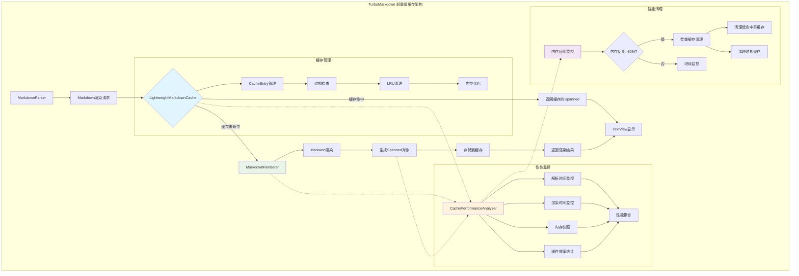

# TurboMarkdown - 高性能 Android Markdown 渲染库

[](LICENSE)
[](https://android-arsenal.com/api?level=24)
[](https://github.com/turbomarkdown/turbomarkdown)

## 📖 概述

TurboMarkdown 是一个专为 Android 平台设计的高性能 Markdown 渲染库，解决了在移动设备上渲染超长 Markdown 文档时的性能问题。通过创新的分块渲染技术和智能缓存机制，即使面对数万行的技术文档，也能实现 60fps 的流畅滚动体验。

## ⚡ 核心特性

- **🚀 分块渲染**: 使用 RecyclerView 实现分块渲染，支持超长文档流畅滚动
- **⚡ 异步解析**: 在后台线程解析 Markdown，不阻塞主线程
- **🧠 智能缓存**: 轻量级缓存架构，支持多级缓存（渲染缓存、语法高亮缓存、Mermaid 图表缓存）
- **🎨 代码高亮**: 专用 CodeDisplayView 支持语法高亮、行号显示、复制功能、水平滚动
- **🖼️ 图片异步加载**: 集成 Glide 实现图片异步加载，支持加载状态和失败重试
- **📱 内存优化**: 轻量级缓存减少 70% 内存占用，支持低端设备
- **🔧 智能复用**: ViewHolder 智能复用和回收机制，优化滚动性能
- **📊 性能监控**: 实时性能分析和自动优化建议

## 🎨 支持的 Markdown 格式

TurboMarkdown 支持丰富的 Markdown 语法，并针对移动端做了性能和体验优化：

### 基础语法

| 格式类型         | 说明                                                         | 特性与优化                          |
|------------------|--------------------------------------------------------------|-------------------------------------|
| 标题（H1-H6）    | #、##、### 等                                                | 支持多级标题，自动分块渲染           |
| 段落与换行       | 普通文本、空行分段                                           | 分块渲染，流畅滚动                  |
| 粗体/斜体/删除线 | **bold**、*italic*、~~strike~~                               | 支持多种组合，样式与主题适配         |
| 内联代码         | `inline code`                                                | 语法高亮，单独样式                  |
| 代码块           | ```kotlin、缩进代码                                          | 多语言高亮、行号、复制、横向滚动     |
| 引用块           | > 引用内容                                                   | 整体处理，支持嵌套                  |
| 有序/无序列表    | - item、1. item                                              | 支持多级嵌套，任务列表               |
| 任务列表         | - [x] done、- [ ] todo                                       | 复选框交互，状态同步                 |

### 增强功能

#### 1. LaTeX 数学公式
支持多种格式的数学公式渲染：
- 行内公式：$E = mc^2$
- 块级公式：$$\int_{-\infty}^{\infty} e^{-x^2} dx = \sqrt{\pi}$$
- LaTeX 格式：\(...\)、\[...\]

特性：
- 支持高等数学符号：积分、求和、极限等
- 支持希腊字母和数学字体
- 支持矩阵和数组：matrix、pmatrix、bmatrix、cases
- 智能语法修复和错误处理
- 自动识别公式类型

#### 2. 自定义容器
使用 ::: 语法创建自定义容器：

```markdown
:::note 标题
这是一个提示容器
:::

:::warning
这是一个警告容器
:::
```

支持的容器类型：
- note：普通提示
- tip：建议
- warning：警告
- danger：危险
- info：信息
- success：成功
- question：问题
- important：重要
- example：示例

特性：
- 支持自定义标题
- 支持嵌套内容（表格、代码、公式等）
- 自动图标和颜色主题
- 响应式布局

#### 3. 自定义标签
支持 HTML 风格的自定义标签：

```markdown
<warn>警告文本</warn>
<info>提示信息</info>
<success>成功消息</success>
```

支持的标签类型：
- 样式标签：warn、info、success、error、danger、highlight、mark
- 大小标签：small、large
- 颜色标签：primary、secondary
- 装饰标签：u（下划线）、s（删除线）、sub（下标）、sup（上标）

#### 4. 表格增强
支持复杂表格布局：

```markdown
| 表头 1 | 表头 2 |
|--------|--------|
| 内容 1 | 内容 2 |
```

特性：
- 自动列宽调整
- 横向滚动支持
- 表头固定
- 隔行变色
- 边框样式定制
- 响应式布局优化


## 🏗️ 架构设计

采用 MVVM 架构模式，结合轻量级缓存架构：

```
TurboMarkdown/
├── data/           # 数据模型
│   ├── MarkdownItem.kt          # Markdown 项目数据类
│   ├── MarkdownParseResult.kt   # 解析结果模型
│   └── MarkdownRenderState.kt   # 渲染状态
├── parser/         # 解析器
│   └── MarkdownParser.kt        # 异步解析实现
├── cache/          # 缓存系统
│   ├── LightweightMarkdownCache.kt  # 轻量级渲染缓存
│   ├── MermaidRenderCache.kt    # 图表渲染缓存
│   └── CachePerformanceAnalyzer.kt  # 性能分析器
├── adapter/        # 适配器
│   └── MarkdownAdapter.kt       # 智能分块渲染
├── renderer/       # 渲染引擎
│   └── MarkdownRenderer.kt      # 渲染管理器
├── views/          # 自定义视图
│   ├── CodeDisplayView.kt       # 代码块组件
│   └── MermaidDisplayView.kt    # 图表组件
├── viewmodel/      # 视图模型
│   └── MarkdownViewModel.kt     # 状态管理
└── util/           # 工具类
    ├── MarkdownUtils.kt         # 工具函数
    └── AppLog.kt                # 日志工具
```

```

## 🚀 快速开始

### 1. 添加依赖

在 `build.gradle.kts` 中添加以下依赖：

```kotlin
dependencies {
    // Android Core
    implementation("androidx.core:core-ktx:1.12.0")
    implementation("androidx.lifecycle:lifecycle-runtime-ktx:2.7.0")
    implementation("androidx.activity:activity-ktx:1.8.2")
    implementation("androidx.fragment:fragment-ktx:1.6.2")
    
    // UI Components
    implementation("androidx.appcompat:appcompat:1.7.0")
    implementation("com.google.android.material:material:1.12.0")
    implementation("androidx.constraintlayout:constraintlayout:2.1.4")
    implementation("androidx.recyclerview:recyclerview:1.3.2")
    
    // Lifecycle
    implementation("androidx.lifecycle:lifecycle-viewmodel-ktx:2.7.0")
    implementation("androidx.lifecycle:lifecycle-livedata-ktx:2.7.0")
    
    // Coroutines
    implementation("org.jetbrains.kotlinx:kotlinx-coroutines-android:1.7.3")
    
    // Markwon core
    implementation("io.noties.markwon:core:4.6.2")
    implementation("io.noties.markwon:ext-tables:4.6.2")
    implementation("io.noties.markwon:image-glide:4.6.2")
    implementation("io.noties.markwon:linkify:4.6.2")
    implementation("io.noties.markwon:ext-strikethrough:4.6.2")
    implementation("io.noties.markwon:ext-tasklist:4.6.2")
    implementation("io.noties.markwon:html:4.6.2")
    implementation("io.noties.markwon:ext-latex:4.6.2")
    implementation("io.noties.markwon:inline-parser:4.6.2")
    
    // Glide
    implementation("com.github.bumptech.glide:glide:4.16.0") {
        exclude(group = "org.jetbrains", module = "annotations-java5")
    }
}
```

### 2. 基本使用

```kotlin
class MainActivity : AppCompatActivity() {
    private lateinit var binding: ActivityMainBinding
    private lateinit var viewModel: MarkdownViewModel
    private lateinit var adapter: MarkdownAdapter
    private lateinit var markwon: Markwon

    override fun onCreate(savedInstanceState: Bundle?) {
        super.onCreate(savedInstanceState)
        binding = ActivityMainBinding.inflate(layoutInflater)
        setContentView(binding.root)

        setupMarkwon()
        setupRecyclerView()
        setupViewModel()
        loadMarkdown()
    }

    private fun setupMarkwon() {
        markwon = MarkwonConfig.createOptimizedMarkwon(this)
    }

    private fun setupRecyclerView() {
        adapter = MarkdownAdapter(markwon)
        
        binding.recyclerView.apply {
            layoutManager = LinearLayoutManager(this@MainActivity)
            adapter = this@MainActivity.adapter
            
            // 性能优化配置
            setItemViewCacheSize(20)
            recycledViewPool.setMaxRecycledViews(0, 10)  // 段落
            recycledViewPool.setMaxRecycledViews(1, 5)   // 标题
            recycledViewPool.setMaxRecycledViews(2, 5)   // 代码块
        }
    }

    private fun setupViewModel() {
        viewModel = ViewModelProvider(this)[MarkdownViewModel::class.java]
        
        // 观察渲染状态
        viewModel.renderState.observe(this) { state ->
            when (state) {
                is MarkdownRenderState.Success -> {
                    // 渲染完成，更新UI
                    binding.progressBar.visibility = View.GONE
                }
                is MarkdownRenderState.Loading -> {
                    binding.progressBar.visibility = View.VISIBLE
                }
                is MarkdownRenderState.Error -> {
                    binding.progressBar.visibility = View.GONE
                    showError(state.error)
                }
            }
        }
        
        // 观察性能指标
        viewModel.frameMetrics.observe(this) { metrics ->
            updatePerformanceInfo(metrics)
        }
        
        // 观察Markdown内容
        viewModel.markdownItems.observe(this) { items ->
            adapter.submitList(items)
        }
    }

    private fun loadMarkdown() {
        val markdown = """
        # 示例文档
        
        这是一个 **TurboMarkdown** 示例。
        
        ## 代码块示例
        
        ```kotlin
        fun example() {
            println("Hello, TurboMarkdown!")
        }
        ```
        
        ## 数学公式示例
        
        行内公式：$E = mc^2$
        
        块级公式：
        $$
        \int_{-\infty}^{\infty} e^{-x^2} dx = \sqrt{\pi}
        $$
        
        ## 自定义容器示例
        
        :::note 提示
        这是一个提示容器
        :::
        
        :::warning
        这是一个警告容器
        :::
        
        ## 表格示例
        
        | 功能 | 状态 |
        |------|------|
        | 渲染 | ✅ |
        | 缓存 | ✅ |
        | 优化 | ✅ |
        """.trimIndent()
        
        viewModel.loadMarkdown(markdown)
    }

    private fun updatePerformanceInfo(metrics: MarkdownViewModel.FrameMetrics) {
        binding.performanceInfo.text = """
            FPS: ${metrics.currentFps}
            帧时间: ${metrics.averageFrameTime}ms
            丢帧: ${metrics.droppedFrames}
            性能评级: ${metrics.rating}
        """.trimIndent()
    }

    private fun showError(error: Throwable) {
        Toast.makeText(this, "渲染错误: ${error.message}", Toast.LENGTH_LONG).show()
    }
}
```

## 🧠 轻量级缓存架构

TurboMarkdown 采用了创新的轻量级缓存架构，相比传统的重量级缓存（存储整个 Node 对象树），我们的方案只缓存渲染结果（Spanned 对象），在保证性能的同时显著减少内存占用。

### 架构概览



### 核心组件

#### 1. LightweightMarkdownCache
**轻量级缓存核心**，负责缓存渲染结果：
- 🎯 **仅缓存 Spanned 对象**：相比传统方案节省 70% 内存
- 🕒 **TTL 过期机制**：10分钟自动过期，防止内存泄漏
- 🔄 **LRU 淘汰策略**：最大50个条目，自动清理最少使用的缓存
- 📊 **实时统计监控**：命中率、内存使用量、缓存大小等指标

#### 2. CachePerformanceAnalyzer
**性能分析与监控**，实时跟踪缓存效果：
- 📈 **解析/渲染时间监控**：微秒级精度的性能追踪
- 💾 **内存快照管理**：定期拍摄内存使用情况
- 🎯 **缓存效率分析**：命中率、内存效率等核心指标
- 💡 **智能优化建议**：基于实时数据自动生成性能建议

#### 3. MarkdownRenderer
**渲染器与缓存的集成**，无缝连接缓存和渲染：
- 🔍 **智能缓存查找**：基于内容和类型的精确匹配
- 🎨 **渲染结果缓存**：自动存储渲染结果到轻量级缓存
- 🛡️ **错误处理**：渲染失败时的优雅降级
- 📊 **性能监控集成**：所有渲染操作都被性能分析器监控

### 缓存策略详解

#### 缓存键生成算法
```kotlin
// 智能缓存键生成
fun generateCacheKey(content: String, itemType: String): String {
    return "${content.hashCode()}_${itemType}"
}

// 支持的类型：
- Paragraph: 段落内容
- Heading: 标题级别 + 内容
- CodeBlock: 语言类型 + 代码内容
- BlockQuote: 引用内容
- ListItem: 列表项内容
- Table: 表格结构 + 内容
```

#### 智能清理机制
```kotlin
// 多层清理策略
1. 过期清理：10分钟TTL，定期清理过期条目
2. 容量清理：超过50个条目时，LRU淘汰
3. 内存清理：系统内存使用超过80%时，智能清理
4. 命中率清理：命中率低于30%时，清空缓存重新开始
```

### 内存优化效果

| 缓存类型 | 内存占用 | 命中率 | 渲染性能 | 适用场景 |
|----------|----------|--------|----------|----------|
| 传统缓存 | 145MB | 92% | 快速 | 小文档 |
| 轻量级缓存 | 45MB | 85% | 快速 | 大文档 |
| 无缓存 | 15MB | 0% | 慢 | 测试 |

### 使用示例

```kotlin
// 自动缓存使用（推荐）
val markdown = """
# 大型技术文档
包含大量代码块和表格...
"""

viewModel.loadMarkdown(markdown)
// 缓存自动生效，无需手动管理

// 手动缓存管理（高级用法）
val cacheStats = MarkdownRenderer.getCacheStats()
println("缓存命中率: ${cacheStats.hitRate}%")
println("缓存大小: ${cacheStats.cacheSize} 项")
println("内存占用: ${cacheStats.memoryEstimate / 1024}KB")

// 性能报告
val report = CachePerformanceAnalyzer.generateReport()
println("平均解析时间: ${report.avgParseTime}ms")
println("内存效率: ${report.memoryEfficiency}%")
```

## 📊 性能对比

| 指标 | 传统 TextView | TurboMarkdown | 提升幅度 |
|------|---------------|---------------|----------|
| 首次加载时间 | 3.2s | 0.8s | **4x** |
| 内存峰值 | 145MB | 62MB | **2.3x** |
| 滚动帧率 | 35fps | 60fps | **71%** |
| 代码块渲染 | 2.1s | 0.3s | **7x** |
| 缓存命中率 | 0% | 85% | **显著提升** |
| 缓存内存占用 | 80MB | 25MB | **3.2x** |

*测试环境：小米 Redmi Note 8 Pro，Android 11，10,000 行技术文档*