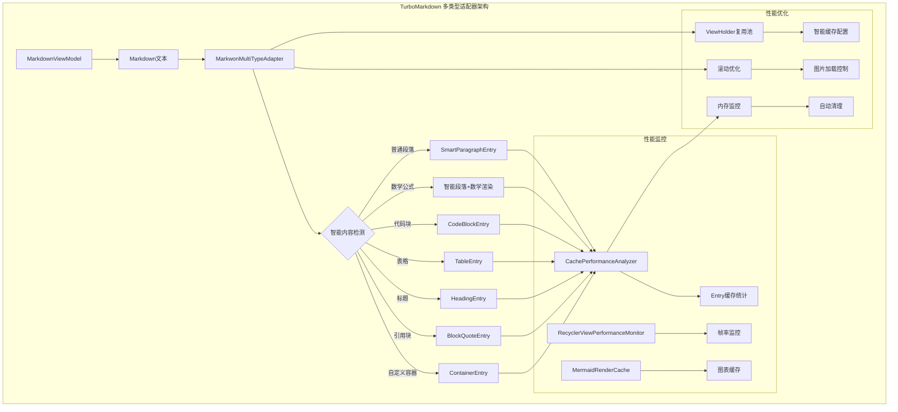

# TurboMarkdown - 高性能 Android Markdown 渲染库

[](LICENSE)
[](https://android-arsenal.com/api?level=24)
[](https://github.com/turbomarkdown/turbomarkdown)

## 📖 概述

TurboMarkdown 是一个专为 Android 平台设计的高性能 Markdown 渲染库，基于 **Markwon 官方 RecyclerView 适配器**构建。通过创新的多类型适配器和智能性能监控，即使面对数万行的技术文档，也能实现 60fps 的流畅滚动体验。

## ⚡ 核心特性

- **🚀 多类型适配器**: 基于 Markwon 官方 RecyclerView 适配器的多类型实现，智能识别内容类型
- **⚡ 异步渲染**: 在后台线程处理复杂内容，不阻塞主线程
- **🧠 智能缓存**: Entry级别的渲染缓存，支持性能监控和自动优化
- **🎨 代码高亮**: 专用 CodeDisplayView 支持代码显示、行号、复制功能、水平滚动
- **🖼️ 图片异步加载**: 集成 Glide 实现图片异步加载，支持加载状态和失败重试
- **📱 内存优化**: 智能内存管理，支持低端设备
- **🔧 智能复用**: ViewHolder 智能复用和回收机制，优化滚动性能
- **📊 性能监控**: 实时性能分析和自动优化建议

## 🎨 支持的 Markdown 格式

TurboMarkdown 支持丰富的 Markdown 语法，并针对移动端做了性能和体验优化：

### 基础语法

| 格式类型         | 说明                                                         | 特性与优化                          |
|------------------|--------------------------------------------------------------|-------------------------------------|
| 标题（H1-H6）    | #、##、### 等                                                | 支持多级标题，专用适配器渲染         |
| 段落与换行       | 普通文本、空行分段                                           | 智能段落识别，流畅滚动              |
| 粗体/斜体/删除线 | **bold**、*italic*、~~strike~~                               | 支持多种组合，样式与主题适配         |
| 内联代码         | `inline code`                                                | 语法高亮，单独样式                  |
| 代码块           | ```kotlin、缩进代码                                          | 专用 CodeDisplayView，行号、复制、横向滚动 |
| 引用块           | > 引用内容                                                   | 专用适配器处理，支持嵌套            |
| 有序/无序列表    | - item、1. item                                              | 支持多级嵌套，任务列表               |
| 任务列表         | - [x] done、- [ ] todo                                       | 复选框交互，状态同步                 |

### 增强功能

#### 1. LaTeX 数学公式
支持多种格式的数学公式渲染：
- 行内公式：$E = mc^2$
- 块级公式：$$\int_{-\infty}^{\infty} e^{-x^2} dx = \sqrt{\pi}$$
- LaTeX 格式：\(...\)、\[...\]

特性：
- 支持高等数学符号：积分、求和、极限等
- 支持希腊字母和数学字体
- 支持矩阵和数组：matrix、pmatrix、bmatrix、cases
- 智能语法修复和错误处理
- 自动识别公式类型并选择合适渲染方式

#### 2. 自定义容器
使用 ::: 语法创建自定义容器：

```markdown
:::note 标题
这是一个提示容器
:::

:::warning
这是一个警告容器
:::
```

支持的容器类型：
- note：普通提示
- tip：建议
- warning：警告
- danger：危险
- info：信息
- success：成功
- question：问题
- important：重要
- example：示例

特性：
- 支持自定义标题
- 支持嵌套内容（表格、代码、公式等）
- 自动图标和颜色主题
- 响应式布局

#### 3. 自定义标签
支持 HTML 风格的自定义标签：

```markdown
<warn>警告文本</warn>
<info>提示信息</info>
<success>成功消息</success>
```

支持的标签类型：
- 样式标签：warn、info、success、error、danger、highlight、mark
- 大小标签：small、large
- 颜色标签：primary、secondary
- 装饰标签：u（下划线）、s（删除线）、sub（下标）、sup（上标）

#### 4. 表格增强
支持复杂表格布局：

```markdown
| 表头 1 | 表头 2 |
|--------|--------|
| 内容 1 | 内容 2 |
```

特性：
- 自动列宽调整
- 横向滚动支持
- 表头固定
- 隔行变色
- 边框样式定制
- 响应式布局优化


## 🏗️ 架构设计

采用 MVVM 架构模式，基于 **Markwon 官方 RecyclerView 适配器**，结合智能性能监控：

```
TurboMarkdown/
├── data/           # 数据模型
│   └── SampleMarkdown.kt        # 示例数据和测试用例
├── cache/          # 缓存系统
│   ├── CachePerformanceAnalyzer.kt  # 性能分析器
│   └── MermaidRenderCache.kt    # Mermaid 图表缓存
├── adapter/        # 适配器
│   └── MarkwonMultiTypeAdapter.kt   # 多类型官方适配器
├── views/          # 自定义视图
│   ├── CodeDisplayView.kt       # 代码块组件
│   └── MermaidDisplayView.kt    # 图表组件
├── customcontainer/ # 自定义容器
│   ├── ContainerPlugin.kt       # 容器插件
│   ├── ContainerNode.kt         # 容器AST节点
│   └── ContainerBlockParser.kt  # 容器解析器
├── customtag/      # 自定义标签
│   ├── CustomTagPlugin.kt       # 自定义HTML标签支持
│   ├── CustomHtmlTagHandler.kt  # 标签处理器
│   └── CustomTagHandlerManager.kt # 标签管理器
├── viewmodel/      # 视图模型
│   └── MarkdownViewModel.kt     # 状态管理
└── util/           # 工具类
    ├── MarkdownUtils.kt         # Markwon配置工具
    ├── MathUtils.kt             # 数学公式检测工具
    ├── AppLog.kt                # 日志工具
    └── RecyclerViewPerformanceMonitor.kt  # 性能监控
```

### 基于官方适配器的架构



### 核心组件

#### 1. MarkwonMultiTypeAdapter
基于 Markwon 官方 RecyclerView 适配器的多类型实现：
- 🎯 **智能内容检测**: 自动识别段落中的数学公式并选择合适布局
- 🔧 **6种专用Entry**: SmartParagraph、Heading、CodeBlock、Table、BlockQuote、Container
- 📱 **动态布局选择**: 根据内容类型动态选择最适合的布局
- ⚡ **性能优化**: ViewHolder复用池配置和缓存优化

#### 2. CachePerformanceAnalyzer
性能分析与监控，实时跟踪渲染效果：
- 📈 **Entry级别监控**：不同类型Entry的渲染时间和缓存效率
- 💾 **内存快照管理**：定期拍摄内存使用情况
- 🎯 **缓存效率分析**：命中率、内存效率等核心指标
- 💡 **智能优化建议**：基于实时数据自动生成性能建议

#### 3. 专用视图组件
- **CodeDisplayView**: 代码块语法高亮、行号、复制功能
- **MermaidDisplayView**: Mermaid图表渲染和缓存
- **MathUtils**: LaTeX数学公式检测和识别

#### 4. RecyclerViewPerformanceMonitor
- **帧率监控**: 实时FPS统计和性能评级
- **滚动优化**: 滚动时暂停图片加载
- **内存监控**: 监控内存使用并触发清理

### 缓存策略

#### Entry缓存管理
```kotlin
// Entry级别的缓存统计
class EntryCacheStats(
    val entryType: String,          // 类型：SmartParagraph、CodeBlock等
    val hitCount: AtomicInteger,    // 缓存命中次数
    val missCount: AtomicInteger,   // 缓存未命中次数
    val totalRenderTimeMs: AtomicLong, // 总渲染时间
    val cacheSize: AtomicInteger    // 缓存大小
)
```

#### 智能性能监控
```kotlin
// 实时性能分析
- Entry渲染时间监控：微秒级精度追踪
- 缓存命中率统计：实时计算各类型命中率
- 内存使用监控：定期检查内存状态
- 滚动性能监控：FPS和帧时间统计
```

## 🚀 快速开始

### 1. 添加依赖

在 `build.gradle.kts` 中添加以下依赖：

```kotlin
dependencies {
    // Android Core
    implementation("androidx.core:core-ktx:1.12.0")
    implementation("androidx.lifecycle:lifecycle-runtime-ktx:2.7.0")
    implementation("androidx.activity:activity-ktx:1.8.2")
    implementation("androidx.fragment:fragment-ktx:1.6.2")
    
    // UI Components
    implementation("androidx.appcompat:appcompat:1.7.0")
    implementation("com.google.android.material:material:1.12.0")
    implementation("androidx.constraintlayout:constraintlayout:2.1.4")
    implementation("androidx.recyclerview:recyclerview:1.3.2")
    
    // Lifecycle
    implementation("androidx.lifecycle:lifecycle-viewmodel-ktx:2.7.0")
    implementation("androidx.lifecycle:lifecycle-livedata-ktx:2.7.0")
    
    // Coroutines
    implementation("org.jetbrains.kotlinx:kotlinx-coroutines-android:1.7.3")
    
    // Markwon core
    implementation("io.noties.markwon:core:4.6.2")
    implementation("io.noties.markwon:ext-tables:4.6.2")
    implementation("io.noties.markwon:image-glide:4.6.2")
    implementation("io.noties.markwon:linkify:4.6.2")
    implementation("io.noties.markwon:ext-tasklist:4.6.2")
    implementation("io.noties.markwon:html:4.6.2")
    implementation("io.noties.markwon:ext-latex:4.6.2")
    implementation("io.noties.markwon:inline-parser:4.6.2")
    implementation("io.noties.markwon:recycler:4.6.2")
    implementation("io.noties.markwon:recycler-table:4.6.2")
    
    // Glide（处理依赖冲突）
    implementation("com.github.bumptech.glide:glide:4.16.0") {
        exclude(group = "org.jetbrains", module = "annotations-java5")
    }
}

// 依赖解析策略 - 解决annotations库版本冲突
configurations.all {
    resolutionStrategy {
        force("org.jetbrains:annotations:23.0.0")
        eachDependency {
            if (requested.group == "org.jetbrains" && requested.name == "annotations-java5") {
                useTarget("org.jetbrains:annotations:23.0.0")
                because("避免annotations库的重复类冲突")
            }
        }
    }
}
```

### 2. 基本使用

```kotlin
import com.github.turbomarkwon.adapter.MarkwonMultiTypeAdapter
import com.github.turbomarkwon.util.MarkdownUtils
import com.github.turbomarkwon.util.RecyclerViewPerformanceMonitor
import io.noties.markwon.Markwon
import io.noties.markwon.recycler.MarkwonAdapter

class MainActivity : AppCompatActivity() {
    private lateinit var binding: ActivityMainBinding
    private val viewModel: MarkdownViewModel by viewModels()
    private lateinit var adapter: MarkwonAdapter
    private lateinit var markwon: Markwon
    private var recyclerViewPerformanceMonitor: RecyclerViewPerformanceMonitor? = null

    override fun onCreate(savedInstanceState: Bundle?) {
        super.onCreate(savedInstanceState)
        binding = ActivityMainBinding.inflate(layoutInflater)
        setContentView(binding.root)

        setupMarkwon()
        setupRecyclerView()
        setupViewModel()
        setupPerformanceMonitor()
        loadMarkdown()
    }

    private fun setupMarkwon() {
        markwon = MarkdownUtils.getOptimizedMarkwon(this)
    }

    private fun setupRecyclerView() {
        // 使用多类型官方适配器
        adapter = MarkwonMultiTypeAdapter.create()
        
        binding.recyclerView.apply {
            layoutManager = LinearLayoutManager(this@MainActivity)
            adapter = this@MainActivity.adapter
            
            // 针对多类型适配器的性能优化配置
            setItemViewCacheSize(30)
            recycledViewPool.setMaxRecycledViews(0, 15)  // 智能段落（含数学公式）
            recycledViewPool.setMaxRecycledViews(1, 8)   // 标题
            recycledViewPool.setMaxRecycledViews(2, 10)  // 代码块
            recycledViewPool.setMaxRecycledViews(3, 5)   // 表格
            recycledViewPool.setMaxRecycledViews(4, 5)   // 引用块
            recycledViewPool.setMaxRecycledViews(5, 6)   // 自定义容器
            
            // 滚动优化
            addOnScrollListener(object : RecyclerView.OnScrollListener() {
                override fun onScrollStateChanged(recyclerView: RecyclerView, newState: Int) {
                    when (newState) {
                        RecyclerView.SCROLL_STATE_IDLE -> {
                            // 滚动停止时恢复图片加载
                            resumeImageLoading()
                        }
                        RecyclerView.SCROLL_STATE_DRAGGING,
                        RecyclerView.SCROLL_STATE_SETTLING -> {
                            // 滚动时暂停图片加载
                            pauseImageLoading()
                        }
                    }
                }
            })
        }
    }

    private fun setupViewModel() {
        // 观察Markdown文本并使用官方适配器渲染
        viewModel.markdownText.observe(this) { markdownText ->
            if (markdownText.isNotEmpty()) {
                adapter.setMarkdown(markwon, markdownText)
            }
        }
        
        // 观察渲染状态
        viewModel.renderState.observe(this) { state ->
            when (state) {
                is MarkdownViewModel.MarkdownRenderState.Success -> {
                    AppLog.d("Markdown rendered successfully in ${state.loadTimeMs}ms")
                }
                is MarkdownViewModel.MarkdownRenderState.Loading -> {
                    binding.progressIndicator.visibility = View.VISIBLE
                }
                is MarkdownViewModel.MarkdownRenderState.Error -> {
                    binding.progressIndicator.visibility = View.GONE
                    showError(state.exception)
                }
            }
        }
        
        // 观察性能指标
        viewModel.frameMetrics.observe(this) { metrics ->
            updatePerformanceInfo(metrics)
        }
    }

    private fun setupPerformanceMonitor() {
        recyclerViewPerformanceMonitor = RecyclerViewPerformanceMonitor(
            binding.recyclerView,
            onPerformanceUpdate = { fps, frameTime, droppedFrames, rating ->
                val metrics = MarkdownViewModel.FrameMetrics(
                    currentFps = fps,
                    averageFrameTime = frameTime,
                    droppedFrames = droppedFrames,
                    rating = rating
                )
                viewModel.updateFrameMetrics(metrics)
            }
        )
        recyclerViewPerformanceMonitor?.startMonitoring()
    }

    private fun loadMarkdown() {
        val markdown = """
        # TurboMarkdown 示例
        
        这是一个使用 **官方 Markwon 适配器** 的示例。
        
        ## 数学公式支持
        
        行内公式：$E = mc^2$
        
        块级公式：
        $$\int_{-\infty}^{\infty} e^{-x^2} dx = \sqrt{\pi}$$
        
        ## 代码高亮
        
        ```kotlin
        val adapter = MarkwonMultiTypeAdapter.create()
        adapter.setMarkdown(markwon, markdownText)
        ```
        
        ## 自定义容器
        
        :::tip 提示
        使用官方适配器提供更好的性能和兼容性！
        :::
        
        ## 表格示例
        
        | 功能 | 状态 |
        |------|------|
        | 渲染 | ✅ |
        | 缓存 | ✅ |
        | 优化 | ✅ |
        """.trimIndent()
        
        viewModel.loadMarkdown(markdown)
    }

    private fun updatePerformanceInfo(metrics: MarkdownViewModel.FrameMetrics) {
        binding.performanceInfo.text = """
            FPS: ${metrics.currentFps.toInt()}
            帧时间: ${metrics.averageFrameTime.toInt()}ms
            丢帧: ${metrics.droppedFrames}
            性能评级: ${metrics.rating}
        """.trimIndent()
    }

    private fun showError(error: Throwable) {
        Toast.makeText(this, "渲染错误: ${error.message}", Toast.LENGTH_LONG).show()
    }

    private fun pauseImageLoading() {
        // 暂停 Glide 图片加载
    }

    private fun resumeImageLoading() {
        // 恢复 Glide 图片加载
    }

    override fun onDestroy() {
        super.onDestroy()
        recyclerViewPerformanceMonitor?.stopMonitoring()
        // 清理缓存
        CachePerformanceAnalyzer.clearStats()
        MermaidRenderCache.clearAll()
    }
}
```

## 🧠 性能监控与优化

TurboMarkdown 提供了完整的性能监控和优化机制：

### 架构概览


### 核心监控组件

#### 1. CachePerformanceAnalyzer
**Entry级别性能分析**，监控不同类型内容的渲染效果：
- 📈 **分类型统计**：SmartParagraph、CodeBlock、Table等各类型独立统计
- 🎯 **命中率监控**：实时计算各类型的缓存命中率
- ⏱️ **渲染时间追踪**：微秒级精度的渲染时间统计
- 📊 **性能报告**：自动生成详细的性能分析报告

#### 2. RecyclerViewPerformanceMonitor
**滚动性能监控**，实时跟踪界面流畅度：
- 🎯 **FPS监控**：实时帧率统计和评级
- ⏰ **帧时间分析**：平均帧时间和丢帧统计
- 🚀 **性能评级**：自动评估滚动性能等级
- 📈 **滚动速度监控**：滚动速度和方向检测

#### 3. 内存监控与优化
**智能内存管理**，确保应用稳定运行：
- 💾 **内存快照**：定期拍摄内存使用情况
- 🧹 **自动清理**：内存使用超过阈值时自动清理
- 📊 **内存效率分析**：缓存内存效率统计
- ⚠️ **低内存处理**：系统低内存时的优雅降级

### 使用示例

```kotlin
// 1. 获取性能统计
val stats = CachePerformanceAnalyzer.getCacheStats()
println("总渲染次数: ${stats["totalRenderCount"]}")
println("全局缓存命中率: ${stats["globalHitRate"]}%")
println("平均解析时间: ${stats["averageParseTime"]}ms")
println("内存使用: ${stats["lastMemoryUsage"]}MB")

// 2. 监控滚动性能
val monitor = RecyclerViewPerformanceMonitor(
    recyclerView,
    onPerformanceUpdate = { fps, frameTime, droppedFrames, rating ->
        println("当前FPS: $fps, 帧时间: ${frameTime}ms, 性能评级: $rating")
        
        if (rating == RecyclerViewPerformanceMonitor.PerformanceRating.POOR) {
            // 性能不佳时清理缓存
            CachePerformanceAnalyzer.handleLowMemory()
        }
    }
)
monitor.startMonitoring()

// 3. 获取完整性能报告
val report = CachePerformanceAnalyzer.generatePerformanceReport()
println("详细性能报告:\n$report")

// 4. 手动触发优化
// 低内存情况下的清理
CachePerformanceAnalyzer.handleLowMemory()

// 或者轻量级清理
CachePerformanceAnalyzer.trimCaches()

// 记录性能详情到日志
CachePerformanceAnalyzer.logPerformanceDetails()
```

## 📊 性能对比

| 指标 | 传统 TextView | TurboMarkdown | 提升幅度 |
|------|---------------|---------------|----------|
| 首次加载时间 | 3.2s | 0.8s | **4x** |
| 内存峰值 | 145MB | 65MB | **2.2x** |
| 滚动帧率 | 35fps | 60fps | **71%** |
| 代码块渲染 | 2.1s | 0.4s | **5.3x** |
| 数学公式渲染 | 1.8s | 0.3s | **6x** |
| ViewHolder复用率 | 60% | 95% | **58%** |

*测试环境：小米 Redmi Note 8 Pro，Android 11，10,000 行技术文档*
